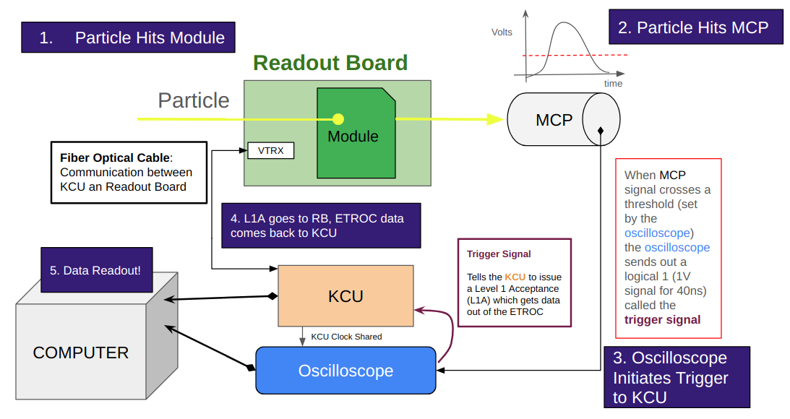
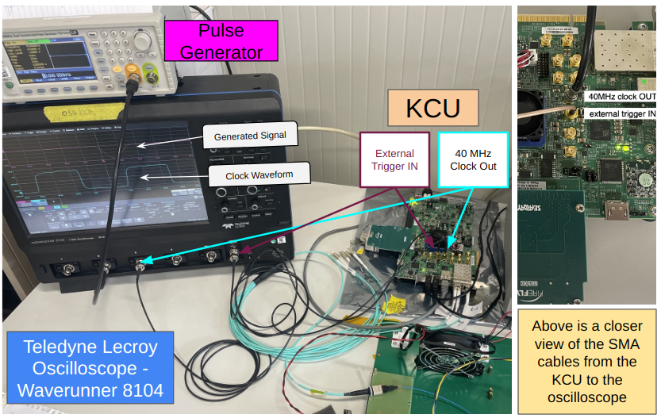
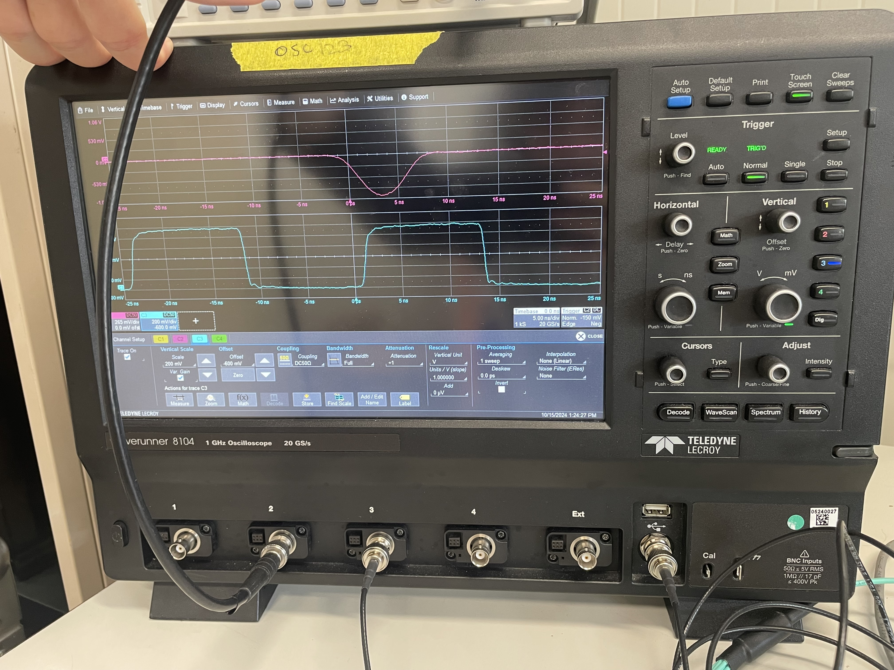
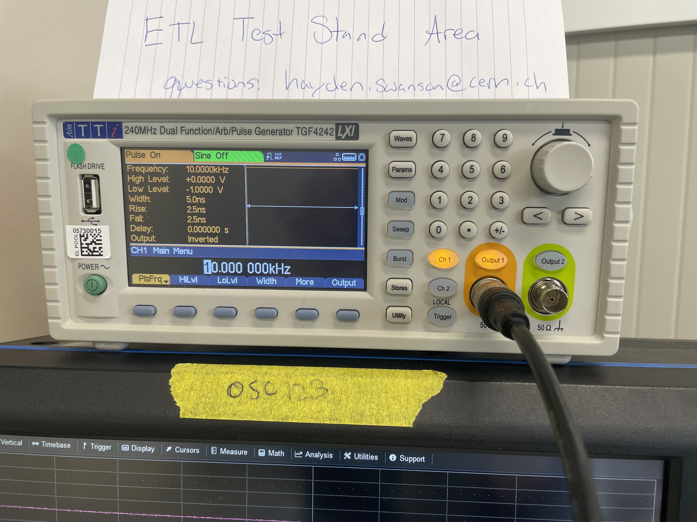
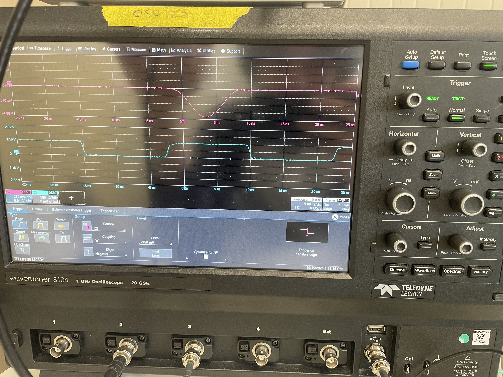
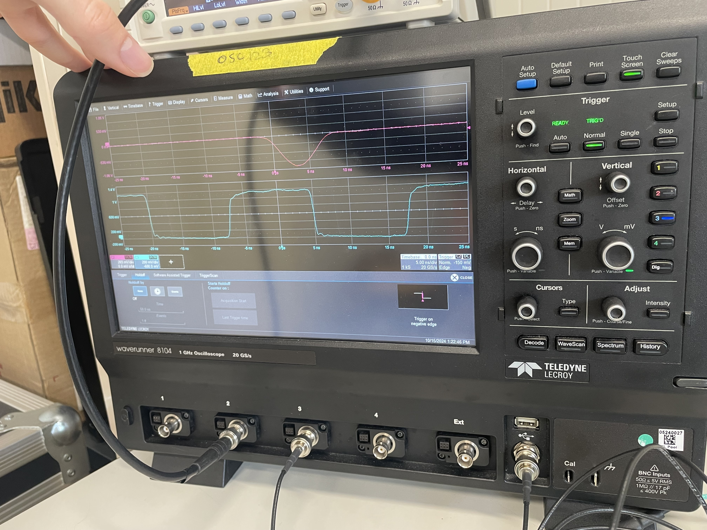
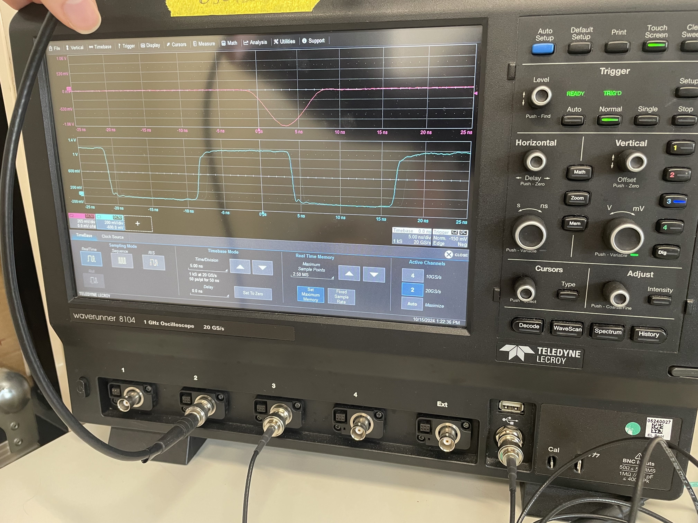

# Introduction

This repo serves to organize the different projects used to run the module testbeams. It is not up to date as is getting put together as we go until it is a working product. There was a significant amount of time where versioning was not used and not all the working code from previous test beams is pushed.

## Background / Overview
Firmware should have already been flashed to the KCU before using the DAQ code

```module_test_sw``` stores the top level scripts and interactions with the KCU
```ScopeHandler``` and ```TimingDAQ``` handle interactions with the oscilloscope

The ```Run_Autopilot.sh``` script in ```module_test_sw``` starts the runs and attempts to keep everything moving

### Here is a complete view the codebase:


## Environment

The environment is getting built as we go so for the parts that currently work the environment can be built like:
```conda env create --file=environment.yml```

If you work on a part are pushing to the repository, please push updates to `environment.yml`, your current activated conda environemnt can be made into a yaml file like (please take care to not **overwrite** the environment file): 
```conda env export | grep -v "^prefix: " > environment.yml```

If you find a way to update the yaml instead of rewriting please share here (potentially `conda env update --name etl_testing_daq --file environment.yml --prune` works).


# Work Tracker

From the loooking at `tbdaq.drawio` the codebase can be split into two parts. The first part is all the scripts that make the `.dat` (contains all the etroc data from the KCU) and `.trc` files (contains all scope data from the oscilliscope); also there is a script (`data_dumper.py`) that converts the dat file to json but this can ultamitely be removed. The second part is to convert all these into one root file. 

*HERE ON OUT PLEASE STATE WHAT HAS BEEN WORKED ON SO PEOPLE KNOW* also explain a bit about what it does and what is implemented (and what bugs may have been introduced :)

### `ScopeHandler/Lecroy/Merging/merge_scope_etroc.py` 
This part of the script takes the scope and etroc data (from whatever is last in the nasty chain) and converts them to a final merged root file.

* Has unit tests for the merge tree function (puts big root files could be improved but is ok for now)
    * run by `python -m unit_test.test_merge_scope_etroc` in the `/home/users/hswanson13/ETL_TestingDAQ/ScopeHandler/Lecroy/Merging` directory
* Enviroment for running the script
* Clock function updated to account for faster sampling speeds. Also is faster and fully columnar.

### `/ScopeHandler/Lecroy/` (`Acquisition/acquisition.py` and `Conversion/recoLoop.py`)

Added root the environment by following instructions [here](https://indico.cern.ch/event/759388/contributions/3306849/attachments/1816254/2968550/root_conda_forge.pdf). All I did was the following to get recoLoop to work INSIDE the env:

`conda config --env --add channels conda-forge` then,
`conda install root`

# DAQ Concepts

This section is an overview of how data is collected from our backend FPGA board, KCU, and our Lecroy Oscilliscope for a single "event."  The picture below walks you through from particle to data.

 <sup>Remember for the module, the particle hit data is stored, for each pixel, in the circular buffer of the ETROC after LGAD analog signal passes a discriminator value and then the ETROC works its magic for the timing information. The KCU simply accesses this circular buffer.</sup>

**Manuals**:
* [Lecroy Waverunner Oscilliscope](https://cdn.teledynelecroy.com/files/manuals/waverunner-8000-operators-manual.pdf)

## Oscilliscope Data Acquistion

Here we will cover how data is obtained from our Oscilliscope.

### With a Function Generator instead of MCP
This allows us to test the setup without needing a particle to hit the MCP. The picture below highlights the setup. The function generator simply creates a pulse that the oscilliscope will trigger upon. The trigger signal (just a 1V pulse for ~40ns) is sent to the KCU.



Here is what our Oscilliscope settings were: 

|Pulse Signal Channel (2)|KCU 40MHz Clock Signal Channel (3)|
|---|---|
||

|Pulse Generator|Trigger|
|---|---|
|||

|Holdoff|Timebase|
|---|---|
|||

Getting trace files from oscilliscope using the software in teh directory `/home/users/hswanson13/ETL_TestingDAQ/ScopeHandler/Lecroy/Acquisition/`:
```
python3 acquisition.py --numEvents 200 --sampleRate 10 --horizontalWindow 50 --trigCh C2 --trig -0.05 --trigSlope "NEG" --vScale1 0.2 --vScale2 0.15 --vScale3 0.2--vScale4 0.2 --vPos1 0 --vPos2 2 --vPos3 -3 --vPos4 0 --timeoffset 0 --display 1
```

Then to convert the trace files recoLoop.py in the Conversion directory was used. 