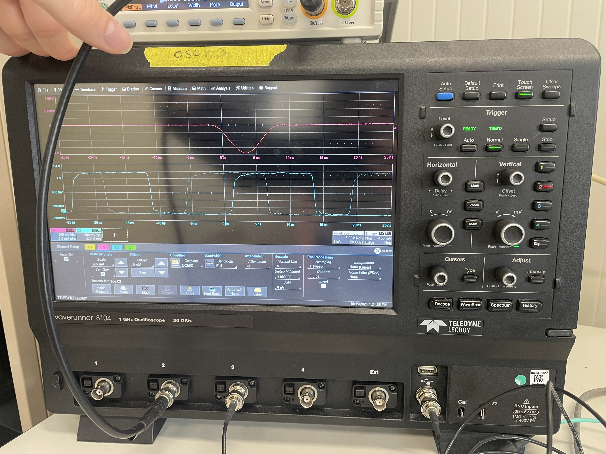

# Introduction

This repository is for system test beams for the MTD ETL project. Currently we use a [KCU105](https://etl-rb.docs.cern.ch/Hardware/#kcu105) as the DAQ and a [MCP](https://en.wikipedia.org/wiki/Microchannel_plate_detector). 

## Background
The project is split up into 3 parts:
* **ETL_TestingDAQ/daq**
    * Contains the code necessary to get oscilliscope trace files and etroc binaries. In all, it will set up the scope, etl front-end electronics and perform the scope acquisition (trace file) while simulataneously streaming the daq (etroc binary). See DAQ Concepts for more info!
        * The actual data acquisition between the scope and streaming our daq is performed by `run_test_beam.py`
        * The static directory contains text files that are used for synchronizing the daq stream and oscilloscope acquisition. Also log and the global run number.
* **ETL_TestingDAQ/processing**
    * Contains code for deconding the binaries, merging them into a root file and exporting/backing up the data
* **ETL_TestingDAQ/monitoring**
    * Contains code for monitoring the test beam setup for example,
        * A high voltage supply monitor that will check the HV and could even turn it off or notify if leakage current is getting dangerous
        * DAQ monitor that looks at hit maps, clock distrobutions, etc...
        * Temperature monitor 

### module_test_sw
We use the tamalero API to interact with the boards. It is a git submodule for this project and is crucial for configuration of the front end electronics. See `daq/etl_telescope.py` for how it is used here!

### The Config
The external variables for the test beam are specified in a file named `config.py` there are also defintions in the file explaing the variables. 

This file defines all variables needed to operate the test beam (str, int, paths etc...). The project isn't locked into using a configuration file, but all user inputs should be validated by the Pydantic models. See [here](https://docs.pydantic.dev/latest/examples/files/) for using other file formats. You can also instantiate the models directly in the code, having one main configuration file is just for what I though is convenient!

## Getting Started
This assumes you already have correclty setup the KCU and installed the ipbus-software. If not please follow [these](https://github.com/nebraska-silicon-lab/Lab-Instructions/blob/master/sop/ETL/200%20-%20ETL%20Test%20Stand%20Setup.md) directions by Ian Reed on getting a Test Stand up and running (it covers everything needed to set up a Test Stand!).

Next, you will need to clone the repository,
```
git clone --recurse-submodules https://gitlab.cern.ch/cms-etl-electronics/ETL_TestingDAQ.git
```

Then you need to install the conda environment and activate it,
```
conda env create --file=environment.yaml
conda activate etl_testing_daq
```

Currently you have the ipbus-software installed but the python package will not be apart of the conda package. To add it you can do the following,
```
export PYTHONPATH=$PYTHONPATH:/path/to/ipbus-software/uhal/python/pkg
```
You will know this is the correct path because in the uhal directory it should have a `__init__.py` file with a `__core.so` binary. `uhal` also has needed dependencies which you can include by `export LD_LIBRARY_PATH=/opt/cactus/lib:$LD_LIBRARY_PATH` but this is in the `setup.sh` file. Which we can now run it because it sets up needed environment variables,
```
source setup.sh
```
You are now ready to run the code for the test beam! Before running it though you need to define a config, right now toml file is only supported in `test_beam.toml` for a place to start! You can also read the pydantic models directly in `config.py`.

## Updating the Environment

If you work on a part are pushing to the repository, please push updates to `environment.yml`, your current activated conda environemnt can be made into a yaml file like: 
```
conda env export | grep -v "^prefix: " > environment.yml
```


# DAQ Concepts

This section is an overview of how data is collected from our backend FPGA board, KCU, and our Lecroy Oscilliscope for a single "event."  The picture below walks you through from particle to data.

 <sup>Remember for the module, the particle hit data is stored, for each pixel, in the circular buffer of the ETROC after LGAD analog signal passes a discriminator value and then the ETROC works its magic for the timing information. The KCU simply accesses this circular buffer.</sup>

**Manuals**:
* [General operator's Lecroy Waverunner Oscilliscope manual](https://cdn.teledynelecroy.com/files/manuals/waverunner-8000-operators-manual.pdf)
    * [Remote Control and Automation Manual](https://cdn.teledynelecroy.com/files/manuals/maui-remote-control-and-automation-manual.pdf)

## Oscilliscope Data Acquistion

Here we will cover how data is obtained from our Oscilliscope.

### With a Function Generator instead of MCP
This allows us to test the setup without needing a particle to hit the MCP. The picture below highlights the setup. The function generator simply creates a pulse that the oscilliscope will trigger upon. The trigger signal (just a 1V pulse for ~40ns) is sent to the KCU.


Here is what our Oscilliscope settings were: 

|Pulse Signal Channel (2)|KCU 40MHz Clock Signal Channel (3)|
|---|---|
||

|Pulse Generator|Trigger|
|---|---|
|||

|Holdoff|Timebase|
|---|---|
|||